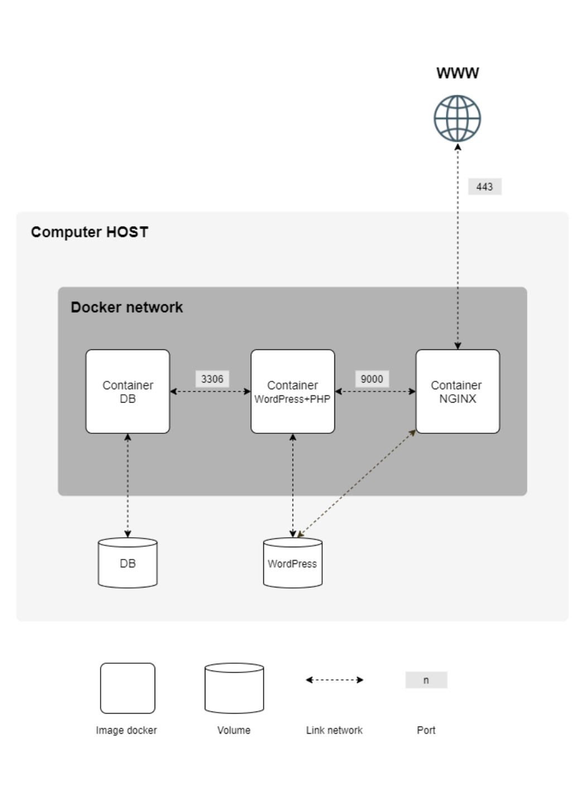

# Inception Requirements

## General Guidelines

- Completed on a Virtual Machine.
- /srcs
- Dockerfiles called indocker-compose.yml by Makefile @root
- Docker image name = service.
- Each service dedicated container.
- Penultimate stable version of Alpine or Debian.
- Dockerfiles, one per service.
- Your containers must restart automatically in case of a crash.
- This domain name must be login.42.fr. 

## Mandatory Part

### Containers
- A Docker container that contains NGINX with TLSv1.2 or TLSv1.3 only.
- A Docker container that contains WordPress with php-fpm (it must be installed and configured) only, without nginx.
- A Docker container that contains only MariaDB, without nginx.

### Network
- A docker-network that establishes the connection between your containers.

### Volumes
- A volume that contains your WordPress database.
- A second volume that contains your WordPress website files.

>Your volumes will be available in the /home/login/data folder of the host machine using Docker. Of course, you have to replace the login with yours.

>In your WordPress database, there must be two users, one of them being the administrator. The administrator’s username must not contain ’admin’, ’Admin’, ’administrator’, or ’Administrator’ (e.g., admin, administrator, Administrator, admin-123, etc.).

## Rules
>A Docker container is not a virtual machine. Thus, it is not recommended to use any hacky patches based on ’tail -f’ and similar methods when trying to run it. 

>Of course, using network: host or --link or links: is forbidden. The network line must be present in your docker-compose.yml file. Your containers must not be started with a command running an infinite loop. Thus, this also applies to any command used as entrypoint, or used in entrypoint scripts. The following are a few prohibited hacky patches: tail -f, bash, sleep infinity, while true.

### Reading
- Read about PID 1 and the best practices for writing Dockerfiles.
- Read about how daemons work and whether it’s a good idea to use them or not.

## Security
>The latest tag is prohibited.
Passwords must not be present in your Dockerfiles.
The use of environment variables is mandatory.
It is also strongly recommended to use a .env file to store environment variables and to use the Docker secrets to store any confidential information.
Your NGINX container must be the sole entry point into your infrastructure, accessible only via port 443, using the TLSv1.2 or TLSv1.3 protocol.

>For obvious security reasons, any credentials, API keys, passwords, etc., must be saved locally in various ways / files and ignored by git. Publicly stored credentials will lead you directly to a failure of the project.

>You can store your variables (as a domain name) in an environment variable file like .env

## Bonus list:

- Set up redis cache for your WordPress website in order to properly manage the cache.
- Set up a FTP server container pointing to the volume of your WordPress website.
- Create a simple static website in the language of your choice except PHP (yes, PHP is excluded). For example, a showcase site or a site for presenting your resume.
- Set up Adminer.
- Set up a service of your choice that you think is useful. During the defense, you will have to justify your choice.

> A Dockerfile must be written for each additional service. Thus, each service will run inside its own container and will have, if necessary, its dedicated volume.

>To complete the bonus part, you have the possibility to set up extra services. In this case, you may open more ports to suit your needs.

### Diagram


### Directory structure:

```bash
$> ls -alR
total XX
drwxrwxr-x 3 wil wil 4096 avril 42 20:42 .
drwxrwxrwt 17 wil wil 4096 avril 42 20:42 ..
-rw-rw-r-- 1 wil wil XXXX avril 42 20:42 Makefile
drwxrwxr-x 3 wil wil 4096 avril 42 20:42 secrets
drwxrwxr-x 3 wil wil 4096 avril 42 20:42 srcs
./secrets:
total XX
drwxrwxr-x 2 wil wil 4096 avril 42 20:42 .
drwxrwxr-x 6 wil wil 4096 avril 42 20:42 ..
-rw-r--r-- 1 wil wil XXXX avril 42 20:42 credentials.txt
-rw-r--r-- 1 wil wil XXXX avril 42 20:42 db_password.txt
-rw-r--r-- 1 wil wil XXXX avril 42 20:42 db_root_password.txt
./srcs:
total XX
drwxrwxr-x 3 wil wil 4096 avril 42 20:42 .
drwxrwxr-x 3 wil wil 4096 avril 42 20:42 ..
-rw-rw-r-- 1 wil wil XXXX avril 42 20:42 docker-compose.yml
-rw-rw-r-- 1 wil wil XXXX avril 42 20:42 .env
drwxrwxr-x 5 wil wil 4096 avril 42 20:42 requirements
./srcs/requirements:
total XX
drwxrwxr-x 5 wil wil 4096 avril 42 20:42 .
drwxrwxr-x 3 wil wil 4096 avril 42 20:42 ..
drwxrwxr-x 4 wil wil 4096 avril 42 20:42 bonus
drwxrwxr-x 4 wil wil 4096 avril 42 20:42 mariadb
drwxrwxr-x 4 wil wil 4096 avril 42 20:42 nginx
drwxrwxr-x 4 wil wil 4096 avril 42 20:42 tools
drwxrwxr-x 4 wil wil 4096 avril 42 20:42 wordpress
./srcs/requirements/mariadb:
total XX
drwxrwxr-x 4 wil wil 4096 avril 42 20:45 .
drwxrwxr-x 5 wil wil 4096 avril 42 20:42 ..
drwxrwxr-x 2 wil wil 4096 avril 42 20:42 conf
-rw-rw-r-- 1 wil wil XXXX avril 42 20:42 Dockerfile
-rw-rw-r-- 1 wil wil XXXX avril 42 20:42 .dockerignore
drwxrwxr-x 2 wil wil 4096 avril 42 20:42 tools
[...]
./srcs/requirements/nginx:
total XX
drwxrwxr-x 4 wil wil 4096 avril 42 20:42 .
drwxrwxr-x 5 wil wil 4096 avril 42 20:42 ..
drwxrwxr-x 2 wil wil 4096 avril 42 20:42 conf
-rw-rw-r-- 1 wil wil XXXX avril 42 20:42 Dockerfile
-rw-rw-r-- 1 wil wil XXXX avril 42 20:42 .dockerignore
drwxrwxr-x 2 wil wil 4096 avril 42 20:42 tools
[...]
$> cat srcs/.env
DOMAIN_NAME=wil.42.fr
# MYSQL SETUP
MYSQL_USER=XXXXXXXXXXXX
[...]
$>
```